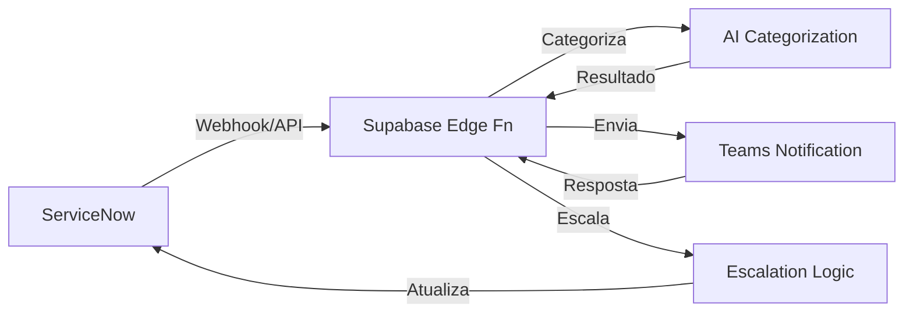

# PROPOSTA TÉCNICA-COMERCIAL
## Automação Inteligente do Follow-Up - Service Desk DASA

---

**Cliente:** DASA  
**Fornecedor:** Leega  
**Data:** [A DEFINIR]  
**Versão:** 1.0  
**Status:** Proposta Técnica-Comercial

---

## 1. CAPA E RESUMO EXECUTIVO

### 1.1. Apresentação

A **Leega** apresenta esta proposta técnica-comercial para desenvolvimento e implementação do sistema de **Automação Inteligente do Follow-Up do Service Desk DASA**, utilizando Inteligência Artificial generativa para transformar o processo manual de monitoramento e categorização de tickets.

### 1.2. Problema Identificado

O Service Desk da DASA enfrenta desafios operacionais significativos:

- **Tempo manual por ticket:** 45 minutos em média
- **Volume de processamento:** 260 tickets/dia
- **Equipe atual:** 30 analistas dedicados ao follow-up
- **Taxa de automação atual:** Apenas 3% dos tickets são processados automaticamente
- **Lead time:** 35 minutos para tickets de Reset/MFA
- **Backlog acumulado:** ~140.000 tickets com 7+ dias sem atualização
- **SLA Compliance:** 60% de aderência

### 1.3. Solução Proposta

Sistema de automação inteligente que integra **ServiceNow TSM**, **Microsoft Teams** e **Active Directory**, utilizando **IA generativa** (OpenAI GPT-4) para:

1. Monitorar automaticamente tickets antigos (7+ dias sem atualização)
2. Categorizar tickets com 92% de acurácia usando IA
3. Realizar contato automático via Teams (3 tentativas estruturadas)
4. Escalar inteligentemente para grupos responsáveis
5. Gerar dashboards e métricas em tempo real

### 1.4. Métricas-Chave Esperadas

| Métrica | Estado Atual | Com Solução | Melhoria |
|---------|--------------|-------------|----------|
| **Tempo por ticket** | 45 min | 5 min | **-89%** |
| **Tickets processados/dia** | 260 | 520+ | **+100%** |
| **Taxa de automação** | 3% | 52% | **+49 p.p.** |
| **Taxa de categorização automática** | 0% | 92% | **+92%** |
| **Lead time Reset/MFA** | 35 min | 16 min | **-55%** |
| **Custo por atendimento** | 100% humano | -50% | **-50%** |
| **Headcount equivalente** | 30 analistas | 15 equiv. | **Eficiência 50%** |
| **NPS** | 65% | 85% | **+20 pontos** |
| **SLA Compliance** | 60% | 95%+ | **+35 p.p.** |

---

## 2. ESCOPO FUNCIONAL (LÓGICO)

### 2.1. Módulo 1: Monitoramento Automático de Tickets

**Descrição:** Sistema que identifica e monitora tickets antigos, analisando usuários inativos e disparando triggers de escalação baseados em regras de negócio.

**Funcionalidades:**

- ✅ Identificação automática de tickets com 7+ dias sem atualização
- ✅ Análise de usuários inativos na rede (integração com Active Directory)
- ✅ Trigger de escalação baseado em regras de negócio configuráveis
- ✅ Dashboard em tempo real com visibilidade completa do backlog
- ✅ Integração nativa com ServiceNow TSM para leitura e atualização de tickets
- ✅ Alertas proativos para gestores de filas responsáveis
- ✅ Histórico completo de ações automáticas realizadas

**Entregas:**
- Engine de monitoramento com jobs agendados
- Dashboard de backlog em tempo real
- Regras de negócio configuráveis via interface

---

### 2.2. Módulo 2: Categorização Inteligente com IA

**Descrição:** Engine de Inteligência Artificial para classificação automática de tickets com alta acurácia, reduzindo retrabalho manual.

**Funcionalidades:**

- ✅ **92% de acurácia** em categorização automática
- ✅ Análise contextual da descrição do ticket usando IA generativa
- ✅ Detecção automática de categorias ausentes no catálogo ServiceNow
- ✅ Fila de revisão humana para os 8% de tickets incertos
- ✅ Aprendizado contínuo com feedback do time de follow-up
- ✅ Suporte a múltiplos modelos de IA (OpenAI GPT-4, Gemini, Claude) - arquitetura plugável
- ✅ Histórico de categorizações para auditoria e melhoria contínua

**Entregas:**
- API de categorização com IA
- Interface de revisão humana para tickets incertos
- Dashboard de acurácia e métricas de categorização

---

### 2.3. Módulo 3: Integração com Microsoft Teams

**Descrição:** Comunicação automática e rastreada via Microsoft Teams, com mensagens padronizadas e evidências de contato.

**Funcionalidades:**

- ✅ Envio automático de mensagens via Teams (Microsoft Graph API)
- ✅ Mensagens padronizadas e personalizáveis por tipo de ticket
- ✅ Rastreamento completo de evidências de contato (timestamp, resposta, status)
- ✅ Resposta automática com contexto completo do ticket
- ✅ Integração com Microsoft Graph API para autenticação e envio
- ✅ Suporte a mensagens individuais e em grupos/canais
- ✅ Template de mensagens configurável por categoria de ticket

**Entregas:**
- Integração completa com Microsoft Teams via Graph API
- Sistema de templates de mensagens
- Dashboard de métricas de resposta via Teams

---

### 2.4. Módulo 4: Roteamento e Escalação Inteligente

**Descrição:** Distribuição automática de tickets para grupos responsáveis baseada em criticidade, com escalação automática após tentativas de contato.

**Funcionalidades:**

- ✅ Roteamento automático baseado em criticidade do ticket
- ✅ Escalação automática após 3 tentativas sem resposta
- ✅ Notificação automática do gestor da fila responsável
- ✅ Rastreamento de SLA por grupo/técnico
- ✅ Métricas de resposta por técnico via Teams
- ✅ Regras de escalação configuráveis (horários, grupos, criticidade)
- ✅ Histórico completo de escalações para auditoria

**Entregas:**
- Engine de roteamento inteligente
- Sistema de escalação automática
- Dashboard de SLA e métricas por grupo

---

### 2.5. Módulo 5: Gerenciamento de Tentativas de Contato

**Descrição:** Processo estruturado de 3 tentativas de contato com horários comerciais e registro de evidências.

**Funcionalidades:**

- ✅ **1 tentativa por dia útil**, durante 3 dias consecutivos
- ✅ Horário comercial configurável (padrão: 08:00-18:00, exceto 12:00-14:00)
- ✅ Contato via Teams e telefone (quando disponível)
- ✅ Registro automático de evidências no chamado ServiceNow
- ✅ Encerramento automático após 3 tentativas sem retorno
- ✅ Notificação ao gestor antes do encerramento automático
- ✅ Dashboard de tentativas e taxa de resposta

**Entregas:**
- Sistema de agendamento de tentativas
- Integração com telefonia (opcional)
- Dashboard de métricas de contato

---

### 2.6. Módulo 6: Qualidade de Dados e Limpeza

**Descrição:** Limpeza e validação contínua de dados, identificando inconsistências e melhorando a qualidade do catálogo.

**Funcionalidades:**

- ✅ Identificação automática de usuários inativos no Active Directory
- ✅ Validação de categorias de ticket contra catálogo ServiceNow
- ✅ Detecção de tickets em "limbo" (sem categoria, sem responsável)
- ✅ Sincronização automática com Active Directory
- ✅ Auditoria completa de mudanças de status e categoria
- ✅ Relatórios de qualidade de dados
- ✅ Sugestões automáticas de correção

**Entregas:**
- Jobs de limpeza e validação de dados
- Dashboard de qualidade de dados
- Relatórios de auditoria

---

## 3. ESCOPO TÉCNICO

### 3.1. Stack Tecnológica

#### Frontend
- **Framework:** React 18.3 com TypeScript
- **Build Tool:** Vite 5
- **Styling:** Tailwind CSS 3.4
- **Icons:** Lucide React
- **State Management:** React Hooks (useState, useMemo, useEffect)

#### Backend
- **Plataforma:** Supabase (PostgreSQL + Edge Functions)
- **Runtime:** Deno (para Edge Functions)
- **Database:** PostgreSQL com Row Level Security (RLS)
- **APIs:** RESTful APIs via Supabase Edge Functions

#### Inteligência Artificial
- **Modelo Principal:** OpenAI GPT-4 (plugável)
- **Arquitetura:** Suporte para múltiplos modelos (Gemini, Claude)
- **Integração:** API-first, permitindo troca de modelo sem reescrita

#### Integrações Externas
- **ServiceNow TSM:** API REST para leitura/atualização de tickets
- **Microsoft Teams:** Microsoft Graph API para envio de mensagens
- **Active Directory:** LDAP/Graph API para sincronização de usuários
- **Power BI:** (Opcional) Para dashboards executivos

---

### 3.2. Arquitetura da Solução

#### Camadas Arquiteturais

```
┌─────────────────────────────────────────────────────────┐
│                    FRONTEND LAYER                       │
│  React Dashboard | Interactive PoC Site | Real-time     │
│                   Metrics                               │
└─────────────────────────────────────────────────────────┘
                            ↕
┌─────────────────────────────────────────────────────────┐
│                 EDGE FUNCTIONS LAYER                    │
│  Teams Integration | Categorization Engine | Escalation │
│                    Logic                                 │
└─────────────────────────────────────────────────────────┘
                            ↕
┌─────────────────────────────────────────────────────────┐
│              DATABASE & STORAGE LAYER                    │
│  Supabase PostgreSQL | RLS Policies | Event Logging    │
└─────────────────────────────────────────────────────────┘
                            ↕
┌─────────────────────────────────────────────────────────┐
│                  EXTERNAL APIs LAYER                    │
│  ServiceNow TSM | Microsoft Teams | Active Directory    │
└─────────────────────────────────────────────────────────┘
```

#### Fluxo de Dados Simplificado



**Fluxo Detalhado:**

1. **ServiceNow** → Webhook dispara quando ticket atinge 7+ dias sem atualização
2. **Supabase Edge Function** → Recebe evento e inicia processamento
3. **AI Categorization Engine** → Analisa descrição do ticket e categoriza (92% acurácia)
4. **Teams Notification** → Envia mensagem automática ao usuário/gestor
5. **Escalation Logic** → Após 3 tentativas sem resposta, escala para grupo responsável
6. **ServiceNow Update** → Atualiza ticket com categoria, evidências e status

---

### 3.3. Integrações Críticas

| Integração | Status | Descrição | Dependências |
|------------|--------|-----------|--------------|
| **ServiceNow TSM** | Critical | API REST para gestão de tickets | Aprovação de API key, permissões de leitura/escrita |
| **Microsoft Teams** | Critical | Microsoft Graph API para envio de mensagens | App Registration no Azure AD, permissões Teams |
| **Active Directory** | Required | Sincronização de usuários e grupos | Acesso LDAP ou Microsoft Graph API |
| **AI/ML Service** | Critical | OpenAI GPT-4 ou equivalente | API key, créditos/configuração |

---

### 3.4. Segurança e Conformidade

#### Autenticação e Autorização
- ✅ **OAuth2 com Azure AD** para Single Sign-On (SSO) corporativo
- ✅ **Role-Based Access Control (RBAC)** com níveis:
  - **Admin:** Acesso total ao sistema
  - **Analista:** Acesso operacional, revisão de categorizações
  - **Viewer:** Apenas visualização de dashboards e relatórios

#### Proteção de Dados
- ✅ **Row Level Security (RLS)** em todas as tabelas do PostgreSQL
- ✅ **Criptografia em trânsito:** TLS 1.3 para todas as comunicações
- ✅ **Criptografia em repouso:** AES-256 para dados sensíveis
- ✅ **Conformidade LGPD:** Auditoria completa de acessos e mudanças
- ✅ **Segurança healthcare:** Conformidade com requisitos de saúde

#### Rate Limiting e Proteção
- ✅ **100 req/min por usuário** autenticado
- ✅ **1000 req/min por API key** para integrações
- ✅ **Throttling automático** em Edge Functions
- ✅ **Proteção contra abuse** e ataques DDoS

#### Auditoria
- ✅ Log completo de todas as ações do sistema
- ✅ Rastreamento de mudanças em tickets
- ✅ Histórico de categorizações e escalações
- ✅ Relatórios de auditoria para compliance

---

### 3.5. APIs Principais

#### Endpoints Implementados

| Método | Endpoint | Descrição | Autenticação |
|--------|----------|-----------|--------------|
| `POST` | `/api/tickets/categorize` | Categoriza ticket via IA | Bearer Token |
| `POST` | `/api/followup/send` | Envia follow-up via Teams | Bearer Token |
| `GET` | `/api/analytics` | Retorna métricas e KPIs | Bearer Token |

#### Autenticação API
- **Bearer Token** no header `Authorization`
- API keys disponíveis em configurações do sistema
- Rate limit por key: 1000 req/min

#### Webhooks
- **ServiceNow webhook** para novos tickets ou atualizações
- **Teams webhook** para respostas de usuários
- Retry automático com backoff exponencial

---

### 3.6. Banco de Dados

#### Schema Principal

**Tabelas:**

1. **`tickets`**
   - Armazena informações dos tickets do ServiceNow
   - Campos: id, servicenow_id, title, description, category, status, created_at, updated_at
   - RLS habilitado

2. **`categorizations`**
   - Histórico de categorizações realizadas pela IA
   - Campos: id, ticket_id, ai_category, confidence, human_reviewed, reviewed_by
   - RLS habilitado

3. **`follow_ups`**
   - Registro de tentativas de contato
   - Campos: id, ticket_id, attempt_number, contact_method, sent_at, responded_at, evidence
   - RLS habilitado

4. **`analytics`**
   - Métricas e KPIs agregados
   - Campos: id, metric_name, metric_value, period, created_at
   - RLS habilitado

#### Migrations
- Sistema de versionamento de schema via migrations SQL
- Cada alteração documentada e reversível
- Backup automático antes de cada migration

#### Backup e Recovery
- Backups automáticos diários via Supabase
- Point-in-time recovery até 7 dias
- Export manual disponível para arquivamento

---

### 3.7. Princípios Arquiteturais

1. **Arquitetura Atemporal**
   - Cérebro (IA), mãos (orquestradores) e canais independentes
   - Permite troca de componentes sem reescrita completa

2. **IA Plugável**
   - OpenAI hoje, Gemini ou Claude amanhã
   - Sem reescrever o sistema ao trocar modelo de IA

3. **API-First + Governança**
   - Segurança corporativa (RBAC, OAuth2, auditoria)
   - APIs bem documentadas e versionadas

4. **Foco em ROI**
   - Dashboards em Power BI demonstrando economia de FTE e tempo
   - Métricas claras de impacto financeiro

5. **Escalabilidade**
   - Padrão multi-canal, pronto para escalar de PoC a produção
   - Suporta crescimento de volume sem reestruturação

---

## 4. CRONOGRAMA E FASES

### 4.1. Visão Geral

- **Duração Total:** 16 semanas (~4 meses)
- **Equipe:** 3 Desenvolvedores Full-Stack
- **Total de Horas:** 1.920 horas (640h por desenvolvedor)

### 4.2. Fase 1: Descoberta e Design (Semanas 1-2)

**Duração:** 2 semanas  
**Esforço:** 240 horas  
**Equipe:** 3 desenvolvedores

**Atividades:**
- Análise detalhada dos requisitos
- Definição da arquitetura técnica completa
- Prototipação de interfaces (UI/UX)
- Planejamento de sprints e backlog priorizado
- Alinhamento com stakeholders DASA
- Planejamento de testes

**Entregas:**
- ✅ Documento de arquitetura técnica completa
- ✅ Protótipos UI/UX das principais telas
- ✅ Backlog priorizado com estimativas
- ✅ Plano de testes (unitários, integração, performance)
- ✅ Matriz de integrações e dependências

**Marco Go/No-Go:** Aprovação do design e arquitetura pela DASA

---

### 4.3. Fase 2: Desenvolvimento Core (Semanas 3-8)

**Duração:** 6 semanas  
**Esforço:** 1.000+ horas  
**Equipe:** 3 desenvolvedores

**Atividades:**
- Setup da infraestrutura (Supabase, ambientes)
- Desenvolvimento da API e integrações
- Implementação do dashboard React
- Sistema de categorização com IA
- Integração ServiceNow TSM
- Integração Microsoft Teams API
- Desenvolvimento de Edge Functions
- Testes unitários durante desenvolvimento

**Entregas:**
- ✅ API totalmente funcional
- ✅ Dashboard operacional com métricas em tempo real
- ✅ Integração ServiceNow/Teams funcional
- ✅ Engine de categorização IA operacional
- ✅ Testes unitários com cobertura >80%

**Marco Go/No-Go:** Backend e integrações funcionando em ambiente de homologação

---

### 4.4. Fase 3: Integração e Testes (Semanas 9-12)

**Duração:** 4 semanas  
**Esforço:** 600+ horas  
**Equipe:** 3 desenvolvedores

**Atividades:**
- Testes de integração completos
- Testes de carga e performance
- Testes de segurança (LGPD, vulnerabilidades)
- Testes de usabilidade
- Bug fixes e otimizações
- Ajustes baseados em feedback

**Entregas:**
- ✅ Relatório completo de testes
- ✅ Evidências de segurança e conformidade LGPD
- ✅ Plano de produção e runbooks
- ✅ Documentação técnica de operação
- ✅ Sistema integrado e validado

**Marco Go/No-Go:** Todos os testes passando, sistema pronto para piloto

---

### 4.5. Fase 4: Piloto com Grupo Select (Semanas 13-14)

**Duração:** 2 semanas  
**Esforço:** 300+ horas  
**Equipe:** 3 desenvolvedores + time Follow-Up DASA

**Atividades:**
- Deploy em ambiente piloto (homologação)
- Treinamento do grupo Follow-Up DASA
- Coleta de feedback dos usuários
- Ajustes baseados em feedback real
- Validação de métricas de sucesso
- Monitoramento intensivo

**Entregas:**
- ✅ Relatório de piloto com métricas
- ✅ Feedback coletado e ações tomadas
- ✅ Go/No-Go para produção
- ✅ Plano de rollout completo

**Marco Go/No-Go:** Validação positiva do piloto, aprovação para produção

---

### 4.6. Fase 5: Deploy e Otimização (Semanas 15-16)

**Duração:** 2 semanas  
**Esforço:** 200+ horas  
**Equipe:** 3 desenvolvedores

**Atividades:**
- Deploy em produção
- Monitoramento 24/7 primeira semana
- Ajustes em tempo real conforme necessário
- Suporte intensivo ao time DASA
- Coleta de métricas finais
- Otimizações pós-lançamento

**Entregas:**
- ✅ Sistema em produção estável
- ✅ Documentação completa de runbooks
- ✅ Plano de suporte pós-deploy
- ✅ Relatório de sucesso com métricas finais

**Marco Final:** Sistema em produção, Go-Live bem-sucedido

---

### 4.7. Marcos Principais (Go/No-Go)

| Marco | Semana | Descrição | Critério de Aprovação |
|-------|--------|-----------|----------------------|
| **M1** | Semana 2 | Design Aprovado | Arquitetura e protótipos aprovados pela DASA |
| **M2** | Semana 8 | Desenvolvimento Completo | Backend e integrações funcionando |
| **M3** | Semana 12 | Testes OK | Todos os testes passando, sistema validado |
| **M4** | Semana 14 | Piloto OK | Validação positiva do piloto |
| **M5** | Semana 16 | Go-Live | Sistema em produção estável |

---

## 5. EQUIPE E ALOCAÇÃO

### 5.1. Composição da Equipe

| Nome | Papel | Horas Totais | Responsabilidades |
|------|-------|--------------|-------------------|
| **Flamarion Fogaça** | Desenvolvedor Full-Stack | 640h | Backend, integrações, arquitetura |
| **Renan Jordão** | Desenvolvedor Full-Stack | 640h | Frontend, dashboard, UI/UX |
| **Jhonathan Ducatti** | Desenvolvedor Full-Stack | 640h | IA, categorização, testes |

**Total:** 1.920 horas de desenvolvimento

### 5.2. Alocação por Fase

| Fase | Horas | % do Total |
|------|-------|------------|
| Fase 1: Descoberta e Design | 240h | 12.5% |
| Fase 2: Desenvolvimento Core | 1.000h | 52.1% |
| Fase 3: Integração e Testes | 600h | 31.3% |
| Fase 4: Piloto | 300h | 15.6% |
| Fase 5: Deploy | 200h | 10.4% |
| **TOTAL** | **1.920h** | **100%** |

*Nota: Algumas horas podem se sobrepor entre fases devido à natureza iterativa do desenvolvimento.*

---

## 6. KPIs E MÉTRICAS DE SUCESSO

### 6.1. KPIs Principais

| KPI | Estado Atual | Meta Projetada | Melhoria |
|-----|--------------|----------------|----------|
| **% Automação Resolutiva** | 3% | 52% | **+49 p.p.** |
| **Lead Time (Reset/MFA)** | 35 min | 16 min | **-55%** |
| **Custo por Atendimento** | 100% humano | -50% | **-50%** |
| **Headcount Equivalente** | 30 analistas | 15 equiv. | **Eficiência 50%** |
| **Taxa de Categorização Automática** | 0% | 92% | **+92%** |
| **Tempo Manual por Ticket** | 45 min | 5 min | **-89%** |
| **Tickets Processados/Dia** | 260 | 520+ | **+100%** |
| **NPS** | 65% | 85% | **+20 pontos** |
| **SLA Compliance** | 60% | 95%+ | **+35 p.p.** |

### 6.2. Métricas Detalhadas (Antes vs Depois)

| Métrica | Estado Atual | Projetado | Melhoria |
|---------|--------------|-----------|----------|
| Tickets/Dia Processados | 260 | 520+ | +100% |
| Tempo Manual p/ Ticket | 45 min | 5 min | -89% |
| Taxa de Resposta Teams | 10-15% | 85-90% | +75% |
| Escalações Automáticas | 0% | 100% | +100% |
| Tickets "Limbo" | ~2.000 | <50 | -97% |
| SLA Compliance | 60% | 95%+ | +35% |
| Tickets Antigos Identificados | 140.000+ | Redução contínua | -35% (primeiro mês) |
| Tempo de Resposta (Teams) | N/A | 4.5h | Nova métrica |

### 6.3. Critérios de Sucesso

**Medição de Sucesso:**
- ✅ Redução >80% no tempo manual por ticket
- ✅ Acurácia de categorização >90%
- ✅ SLA compliance >95%
- ✅ NPS +15+ pontos em relação ao baseline

**Benefícios Financeiros:**
- ✅ Economias mensuráveis de horas/mês
- ✅ ROI positivo em 6-8 meses
- ✅ Payback positivo no primeiro ano
- ✅ Redução significativa do custo operacional

**Impacto Não-Financeiro:**
- ✅ Aumento da satisfação do usuário
- ✅ Melhoria na retenção de clientes
- ✅ Fortalecimento da imagem DASA
- ✅ Aumento da produtividade do time

---

## 7. ANÁLISE DE ROI

### 7.1. Cenário Base (Conservador)

**Parâmetros:**
- Tickets por mês: 7.800
- Tempo manual atual: 45 min/ticket
- Tempo com IA: 5 min/ticket
- Custo hora/pessoa: R$ 50,00
- Custo de implementação: R$ [A DEFINIR]

**Cálculos:**

| Item | Valor |
|------|-------|
| Horas atuais por mês (manual) | 5.850h |
| Horas futuras por mês (IA) | 650h |
| **Economia de horas/mês** | **5.200h** |
| **Economia mensal** | **R$ 260.000** |
| **Economia anual** | **R$ 3.120.000** |
| **Payback** | **[A DEFINIR] meses** |
| **ROI 3 anos** | **[A DEFINIR]%** |

### 7.2. Cenário Médio

**Parâmetros:**
- Tickets por mês: 10.000
- Tempo manual atual: 40 min/ticket
- Tempo com IA: 5 min/ticket
- Custo hora/pessoa: R$ 50,00
- Custo de implementação: R$ [A DEFINIR]

**Cálculos:**

| Item | Valor |
|------|-------|
| Horas atuais por mês (manual) | 6.667h |
| Horas futuras por mês (IA) | 833h |
| **Economia de horas/mês** | **5.834h** |
| **Economia mensal** | **R$ 291.700** |
| **Economia anual** | **R$ 3.500.400** |

### 7.3. Cenário Otimista

**Parâmetros:**
- Tickets por mês: 12.000
- Tempo manual atual: 35 min/ticket
- Tempo com IA: 5 min/ticket
- Custo hora/pessoa: R$ 50,00
- Custo de implementação: R$ [A DEFINIR]

**Cálculos:**

| Item | Valor |
|------|-------|
| Horas atuais por mês (manual) | 7.000h |
| Horas futuras por mês (IA) | 1.000h |
| **Economia de horas/mês** | **6.000h** |
| **Economia mensal** | **R$ 300.000** |
| **Economia anual** | **R$ 3.600.000** |

### 7.4. Observações sobre ROI

- Os cálculos acima são estimativas baseadas em parâmetros conservadores
- O ROI real dependerá do volume efetivo de tickets processados
- Economias adicionais podem ser obtidas com redução de headcount ou realocação de equipe
- Benefícios não-financeiros (satisfação, retenção) não estão quantificados mas são significativos

---

## 8. DEPENDÊNCIAS E RISCOS

### 8.1. Dependências Críticas

| Dependência | Descrição | Responsável | Status |
|-------------|-----------|-------------|--------|
| **Aprovação API ServiceNow** | Acesso à API REST do ServiceNow TSM com permissões de leitura/escrita | DASA | [A CONFIRMAR] |
| **Acesso Teams API** | App Registration no Azure AD com permissões Microsoft Graph API | DASA | [A CONFIRMAR] |
| **Dados AD Sincronizados** | Acesso ao Active Directory ou Microsoft Graph para sincronização de usuários | DASA | [A CONFIRMAR] |
| **Ambiente de Homologação** | Ambiente ServiceNow de homologação para testes | DASA | [A CONFIRMAR] |
| **Credenciais OpenAI** | API key e configuração do modelo GPT-4 | Leega | [A CONFIRMAR] |

### 8.2. Riscos Identificados

| Risco | Probabilidade | Impacto | Mitigação |
|-------|---------------|---------|-----------|
| **Atraso na aprovação de APIs** | Média | Alto | Iniciar processo de aprovação imediatamente, ter ambiente de mock para desenvolvimento |
| **Mudanças de escopo durante desenvolvimento** | Média | Médio | Processo de change request documentado, aprovação formal necessária |
| **Performance da API de IA** | Baixa | Médio | Arquitetura plugável permite troca de modelo, cache de resultados |
| **Integração complexa com ServiceNow** | Média | Alto | POC técnica antes do desenvolvimento completo, documentação detalhada da API |
| **Resistência do time ao uso do sistema** | Baixa | Médio | Treinamento adequado, envolvimento do time desde o início, feedback contínuo |

### 8.3. Plano de Mitigação

- ✅ **Piloto com grupo pequeno:** Validação antes do rollout completo
- ✅ **Rollback plan definido:** Capacidade de reverter mudanças rapidamente
- ✅ **Suporte 24/7 primeira semana:** Monitoramento intensivo pós-go-live
- ✅ **Ambiente de homologação:** Testes completos antes de produção
- ✅ **Documentação completa:** Runbooks e procedimentos operacionais

---

## 9. PROPOSTA COMERCIAL

### 9.1. Investimento Total

**Valor Total do Projeto:** R$ [A DEFINIR]

**Composição:**
- Desenvolvimento: R$ [A DEFINIR]
- Infraestrutura (Supabase, OpenAI): R$ [A DEFINIR]
- Gestão de Projeto: R$ [A DEFINIR]
- Suporte pós-deploy (3 meses): R$ [A DEFINIR]

### 9.2. Condições de Pagamento

**Opção 1 - Pagamento por Fase:**
- 20% na assinatura do contrato
- 20% na aprovação da Fase 1 (Design)
- 30% na aprovação da Fase 2 (Desenvolvimento Core)
- 20% na aprovação da Fase 3 (Testes)
- 10% no Go-Live (Fase 5)

**Opção 2 - Pagamento Mensal:**
- [A DEFINIR] parcelas mensais de R$ [A DEFINIR]

### 9.3. Custos Recorrentes (Pós-Implementação)

| Item | Valor Mensal | Responsável |
|------|--------------|-------------|
| **Supabase** (Plano Pro) | R$ [A DEFINIR] | Leega ou DASA |
| **OpenAI API** (uso estimado) | R$ [A DEFINIR] | Leega ou DASA |
| **Suporte e Manutenção** | R$ [A DEFINIR] | Leega |

*Nota: Custos de infraestrutura podem ser assumidos pela DASA ou incluídos no contrato de suporte.*

### 9.4. SLA de Suporte Pós-Deploy

**Período Incluso:** 3 meses após Go-Live

| Tipo de Suporte | Tempo de Resposta | Horário |
|-----------------|-------------------|---------|
| **Crítico** (Sistema fora do ar) | 2 horas | 24/7 |
| **Alto** (Funcionalidade principal afetada) | 4 horas | Horário comercial |
| **Médio** (Funcionalidade secundária) | 8 horas | Horário comercial |
| **Baixo** (Melhorias, dúvidas) | 24 horas | Horário comercial |

**Após 3 meses:** Contrato de suporte anual separado (opcional)

---

## 10. PREMISSAS E EXCLUSÕES

### 10.1. Premissas

1. ✅ Acesso às APIs do ServiceNow será fornecido pela DASA dentro do prazo acordado
2. ✅ Ambiente de homologação ServiceNow disponível para testes
3. ✅ Acesso ao Active Directory ou Microsoft Graph API será fornecido pela DASA
4. ✅ Time DASA disponível para validações e feedback durante o projeto
5. ✅ Volume de tickets e métricas atuais são precisos conforme informado
6. ✅ Infraestrutura de rede e segurança da DASA suporta as integrações propostas
7. ✅ Aprovações internas da DASA ocorrerão dentro dos prazos definidos

### 10.2. Exclusões

1. ❌ **Integração com sistemas não mencionados** (ex: WhatsApp Business, outros sistemas de telefonia)
2. ❌ **Customizações específicas do ServiceNow** além das integrações de API
3. ❌ **Treinamento extensivo** além do grupo piloto (treinamento adicional será cotado separadamente)
4. ❌ **Migração de dados históricos** (sistema trabalhará com dados a partir do Go-Live)
5. ❌ **Desenvolvimento de funcionalidades não especificadas** neste documento
6. ❌ **Infraestrutura de servidores próprios** (utilizaremos Supabase cloud)
7. ❌ **Licenças de software de terceiros** (ServiceNow, Microsoft Teams, OpenAI - responsabilidade da DASA)

### 10.3. Change Requests

- Mudanças de escopo durante o projeto serão tratadas via **Change Request**
- Cada Change Request será avaliado e cotado separadamente
- Aprovação formal da DASA necessária antes da implementação

---

## 11. PRÓXIMOS PASSOS

### 11.1. Aprovação da Proposta

1. **Revisão interna DASA** desta proposta técnica-comercial
2. **Alinhamento de expectativas** e esclarecimento de dúvidas
3. **Negociação comercial** (valores, condições de pagamento)
4. **Assinatura do contrato** e início do projeto

### 11.2. Kick-off do Projeto

Após assinatura do contrato:

1. **Reunião de kick-off** com todos os stakeholders
2. **Definição de cronograma detalhado** com marcos específicos
3. **Setup de ambientes** e acesso às APIs necessárias
4. **Início da Fase 1:** Descoberta e Design

### 11.3. Contato

Para dúvidas, esclarecimentos ou negociação:

**Leega**  
**Contato:** [A DEFINIR]  
**Email:** [A DEFINIR]  
**Telefone:** [A DEFINIR]

---

## 12. ANEXOS

### 12.1. Glossário

- **PoC:** Proof of Concept (Prova de Conceito)
- **RLS:** Row Level Security (Segurança em Nível de Linha)
- **RBAC:** Role-Based Access Control (Controle de Acesso Baseado em Funções)
- **SSO:** Single Sign-On (Autenticação Única)
- **SLA:** Service Level Agreement (Acordo de Nível de Serviço)
- **NPS:** Net Promoter Score (Pontuação de Promoção Líquida)
- **FTE:** Full-Time Equivalent (Equivalente a Tempo Integral)
- **API:** Application Programming Interface (Interface de Programação de Aplicações)
- **LGPD:** Lei Geral de Proteção de Dados

### 12.2. Referências Técnicas

- Documentação ServiceNow REST API
- Microsoft Graph API Documentation
- Supabase Documentation
- OpenAI API Documentation

---

**FIM DO DOCUMENTO**

---

*Este documento é confidencial e destinado exclusivamente à DASA. Qualquer divulgação não autorizada é proibida.*
